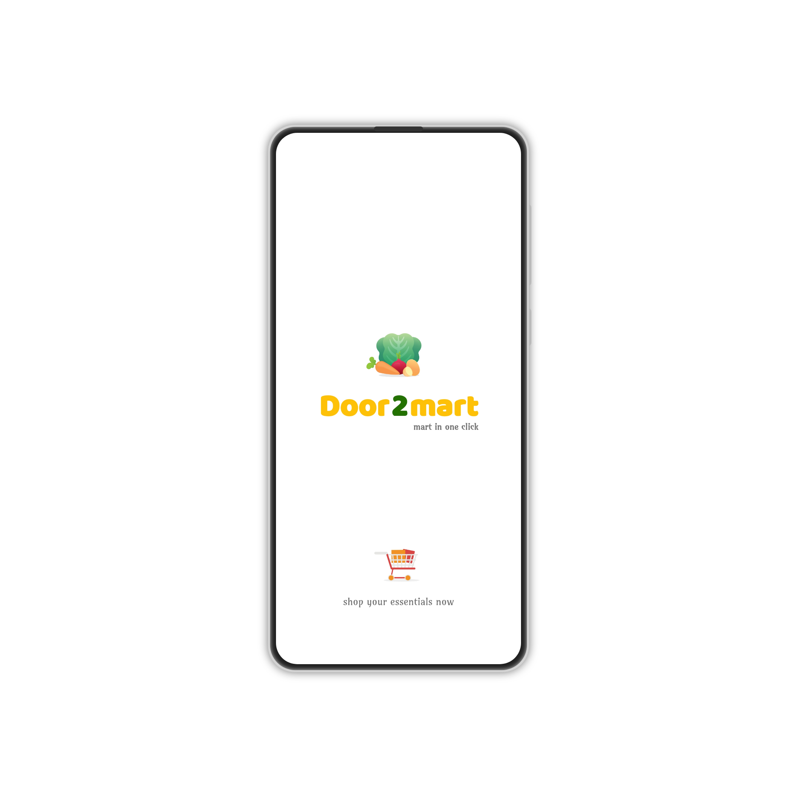

# 🛒 Door2Mart — Android E-Commerce App

A full-stack e-commerce Android application for fruit & vegetable shopping built using Java, Firebase, PHP, and MySQL.

## 📱 Features

- 🔐 OTP-based login with Firebase Authentication
- 🛍 Product listing and cart management
- 🧾 Order placement and tracking
- 🚚 Real-time order status updates
- 📦 Admin web dashboard (PHP + MySQL)
- 🌐 Retrofit-based API integration
- 🎨 Clean Material UI with custom splash and login screens

## 🔧 Tech Stack

| Layer            | Tech |
|------------------|------|
| Frontend (Android) | Java, Android SDK, Firebase |
| Frontend (Admin-Web) | HTML, CSS, Javascript, Bootstrap |
| Backend           | PHP, MySQL |
| API Communication | Retrofit |
| Auth              | Firebase PhoneAuth |
| Design            | XML, Material Design |
| Version Control   | Git, GitHub |

## 📸 Screenshots

## 📱 App Screenshots

| Splash Screen | Login | Home |
|---------------|-------|------|
|  |  |  |

| Category | SubCategory | Product Page |
|----------|-------------|--------------|
|  |  |  |

| Cart | Order Summary | Order History |
|------|----------------|----------------|
|  |  |  |

| Address + Payment | Verification | Success |
|-------------------|-------------|---------|
|  |  |  |


## 🚀 Setup Instructions

1. Clone the repo:
```bash
git clone https://github.com/msubhasish789/door2mart-android.git
